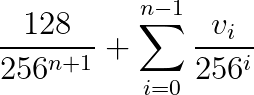
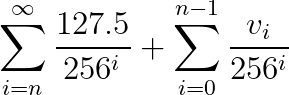
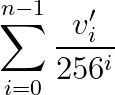

# `fractional_index`

This crate implements fractional indexing, an term coined (I think?) by Figma in their blog post
[*Realtime Editing of Ordered Sequences*](https://www.figma.com/blog/realtime-editing-of-ordered-sequences/).

Specifically, this crate provides a type called `ZenoIndex`. A `ZenoIndex` acts as a
“black box” that has no accessor functions, can only be used by comparing it to
another `ZenoIndex`, and can only be constructed from a default constructor or by
reference to an existing `ZenoIndex`.

This is useful as a key in a `BTreeMap` when we want to be able to arbitrarily insert or
re-order elements in a collection, but don't actually care what the key is.

For an ordered sequence data structure built atop this implementation, see the [List](https://aper.dev/doc/aper/data_structures/struct.List.html)
implementation of [Aper](https://aper.dev/).

## Introduction

Given a key-value store that is sorted by key, we can construct an ordered list by assigning
each value an arbitrary ascending key in some ordered type. However, our ability to perform
an insert to an arbitrary position in the list will depend on our ability to construct a key
between the two adjacent values.

A naive approach to this is to use a floating-point number as the key. To find a key between two
adjacent values, we could average those two values. However, this runs into numerical precision
issues where, as the gap between adjacent values becomes smaller, it becomes impossible to
find a new value that is strictly between two others. (If you squint, this is like the [line-numbering problem](https://en.wikipedia.org/wiki/Line_number#Line_numbers_and_style) that plagued BASIC developers.)

One solution to this is to replace the floats with arbitrary-precision fractions, with which 
you can always 
represent a number strictly between two other (non-equal) numbers. Aside from polluting your
data structure code with unnecessary arithmatic, the downside is that the 
room needed to store this representation tends to grow with repeated averaging. This happens in 
decimal, too: suppose we need to find a value between 0.76 and 0.63. Averaging gives us 0.695, 
which requires an extra digit to represent than the original two numbers. But for the purpose 
of ordering, we really just need a number x such that 0.63 < x < 0.76. We would be just as 
happy to use 0.7, which requires fewer digits than the original numbers to represent.

At the core of a `ZenoIndex` is an arbitrary-precision floating-point number, but by limiting
the interface to comparisons and providing weaker semantics, the implementation is free to
make optimizations akin to the example above (albeit in base-256) in order to optimize for 
space.

Figma's post sketches the approach they use, which is based on a string representation
of fractional numbers, and some of the implementation details are left up to the reader. This crate attempts to formalize the math behind the approach and provide a clean interface that abstracts the implementation details away from the crate user.

## Zeno Index

To differentiate between the *concept* of fractional indexing and the mathematical implementation used here, I have called the mathematical implementation I used a **Zeno index** after the philosopher Zeno of Elea, whose [dichotomy paradox](https://plato.stanford.edu/entries/paradox-zeno/#ParMot) has fun parallels to the implementation.

This crate exposes the `ZenoIndex` struct. The things you can do with a `ZenoIndex` are, by design,
very limited:

- Construct a default `ZenoIndex` (`Default` implementation).
- Given any `ZenoIndex`, construct another `ZenoIndex` before or after it.
- Given any two `ZenoIndex`es, construct a `ZenoIndex` between them.
- Compare two `ZenoIndex`es for order and equality.
- Serialize and deserialize using serde.

Notably, `ZenoIndex`es are opaque: even though they represent a number, they don't
provide an interface for accessing that number directly. Additionally, they
don't provide guarantees about representation beyond what is exposed by the interface,
which gives the implementation room to optimize for space.

## Examples

```rust
use fractional_index::ZenoIndex;

fn main() {
    // Unless you already have a ZenoIndex, the only way to obtain one is using
    // the default constructor.
    let idx = ZenoIndex::default();

    // Now that we have a ZenoIndex, we can construct another relative to it.
    let idx2 = ZenoIndex::new_after(&idx);

    assert!(idx < idx2);

    // Now that we have two ZenoIndexes, we can construct another between them.
    // new_between returns an Option, since it is impossible to construct a
    // value between two values if they are equal (it also returns None if
    // the first argument is greater than the first).
    let idx3 = ZenoIndex::new_between(&idx, &idx2).unwrap();

    assert!(idx < idx3);
    assert!(idx3 < idx2);

    let idx4 = ZenoIndex::new_before(&idx);

    assert!(idx4 < idx);
    assert!(idx4 < idx2);
    assert!(idx4 < idx3);

    // It is legal to construct an index between two other values, however,
    // the only guarantees with regards to ordering are that:
    // - The new value will compare appropriately with the values used in its
    //   construction.
    // - Comparisons with other values are an undefined implementation detail,
    //   but comparisons will always be transitive. That said, it is possible
    //   (likely, even) to construct two values which compare as equal, so
    //   care must be taken to account for that.
    let idx5 = ZenoIndex::new_between(&idx4, &idx2).unwrap();
}
```

## Considerations

All operations on a `ZenoIndex` are deterministic, which means that if you construct a
`ZenoIndex` by reference to the same other `ZenoIndex`es, you will get the same
`ZenoIndex` back. Without care, this may mean that an insert replaces an existing value
in your data structure. The right solution to this will depend on your use-case, but options 
include:

- Only ever use `new_between` for keys that are adjacent in your data structure,
  only use `new_before` on the least key in your data structure, and only use `new_after`
  on the greatest key. This way, you will never construct a `ZenoIndex` that is already
  a key in your data structure.
- When inserting into your data structure, look for a value that already has that key;
  if it does, transform the key by calling `new_between` with its adjacent key.

## Implementation

One of the goals of this crate is to provide an opaque interface that you can use
without needing to study the implementation, but if you're interested in making changes
to the implementation or just curious, this section describes the implementation.

### Representation

Each `ZenoIndex` is backed by a (private) `Vec<u8>`, i.e. a sequence of bytes. 
Mathematically, the numeric value represented by this sequence of bytes is:



Where *n* is the number of bytes and *v<sub>i</sub>* is the value of the *i<sup>th</sup>* byte (zero-indexed).

The right term alone would be sufficient as an arbitrary-precision fraction representation, but the left term serves several purposes:

- It makes it impossible to represent zero. This is necessary because we always need to be able to represent a value *between* a `ZenoIndex` and zero.
- It ensures that no two differing sequences of bytes represent the same number (without it, trailing zeros could be added without changing the represented numeric value).
- It removes the “floor bias” that would bias the representation towards zero. In particular, it means that an empty sequence of bytes represents ½ instead of 0.

### Comparisons

To compare two numbers using this representation, we iterate through them byte-wise. If they differ at a given index, we can simply compare those values to determine the order.

Things get more complicated when one string of bytes is a prefix of the other. Without the first term, our representation would be [lexicographic](https://en.wikipedia.org/wiki/Lexicographic_order) and we could say the shorter one comes before the longer one. Due to the first term, though, the longer one could either be before or after. So we check the following byte to see if it is at most 127 (in which case the longer string comes *before* its prefix) or not (in which case the longer string comes *after*).

To simpilify the code, we take advantage of some properties of infinite series. The representation above is equivalent to



which we can rewrite as



by defining *v'<sub>i<sub>* as the *i<sup>th</sup>* byte when *i* < *n* or 127.5 if *i* ≥ *n*.

Since it's impossible to represent 127.5 as a byte, we convert bytes into an `enum` 
representation where they can take either a standard `u8` byte value, or the “magic” value of 
127.5 (the word *magic* here is used more in the [wizard sense](https://en.wikipedia.org/wiki/Places_in_Harry_Potter#Platform_Nine_and_Three-Quarters) than the [computational one](https://en.wikipedia.org/wiki/Magic_number_(programming))). The comparison operator is implemented on 
this enum such that the magic value compares as greater than 127 but less than 128.

### Construction

There are three ways to construct a `ZenoIndex`:

- From nothing: `ZenoIndex` implements `Default`. Under the hood, this constructs a Zeno Index backed by an empty byte string -- i.e., equivalent to 0.5.
- In relation to one other `ZenoIndex` (either before or after). We walk through the reference 
`ZenoIndex`'s byte string, and see if we can increment or decrement it. If we get to the end,
we add another byte to the end to get a new `ZenoIndex` with the  desired order.
- In between two other `ZenoIndex`es. We find the first byte index at which they differ. If the 
values of the index at which they differ fall on different sides of 127.5, we use the prefix 
that both share as the representation of the newly constructed `ZenoIndex`. Otherwise, we look 
for a byte value between the two, and extend the representation by a byte if that isn't 
possible.

These are not the only way to satisfy the public interface of `ZenoIndex`, so they represent 
certain design considerations. In particular, the decision to increment or decrement the last 
byte by 1 instead of averaging with 0 or 255 comes from the fact that we expect a new item to 
often come directly after the last new item. In the limit case of a data structure that is only 
ever appended to, this allows us to grow the size of the underlying representation by a byte 
only once every 64 new items, instead of every 8 if we averaged.

Likewise, the decision to check whether two differing bytes straddle 127.5 is not strictly 
necessary, but allows us to find opportunities to use a smaller underlying representation in 
cases where items have been removed from a data structure. If we instead were to just average 
the two values, it would be likely that a collection of elements would grow in representation 
size over successive additions and deletions, even if the number of elements stayed constant.
